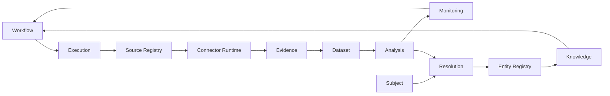

# Investigation Intelligence Platform — Knowledge Base v1

**Status:** Architecture baseline locked through Cross-Cutting Architecture v1  
**Purpose:** Menjadi sumber pengetahuan bersama untuk product owner, analyst, backend engineer, frontend engineer, data/ML engineer, QA, security, dan stakeholder lain selama pengembangan platform.

Platform diposisikan sebagai:

> **Investigation Intelligence Platform** — platform tempat investigator mengumpulkan data, memverifikasi identitas, membangun relasi, menguji hipotesis, memonitor isu, dan menghasilkan temuan yang dapat dipertanggungjawabkan serta diaudit.

## Prinsip utama

1. Canvas bukan database; canvas adalah interaction/presentation layer.
2. Candidate bukan Entity.
3. Evidence bukan otomatis truth.
4. Analysis bukan otomatis Knowledge.
5. Case Knowledge tidak otomatis menjadi Workspace Knowledge.
6. Entity canonical dapat digunakan ulang lintas Case dalam Workspace.
7. Evidence, Finding, Hypothesis, dan konteks investigasi tetap Case-scoped.
8. Human review diperlukan pada identity attribution dan high-risk correlation.
9. Provenance, konflik, keputusan, dan history tidak boleh hilang secara destructive.
10. SHADOW, ECHO, SPECTRA adalah experience boundaries, bukan tiga silo backend.

## Tiga backbone pipeline

- **Execution & Collection:** `Workflow → Execution → Source Registry → Connector Runtime → Evidence`
- **Intelligence:** `Evidence → Dataset → Analysis → Monitoring`
- **Identity & Knowledge:** `Subject → Resolution → Entity Registry → Knowledge`

## Dokumen

| Dokumen | Isi |
|---|---|
| `01_SYSTEM_CONCEPT.md` | Konsep platform, positioning, tiga aplikasi, mental model sistem |
| `02_GLOSSARY.md` | Glosarium istilah domain dan teknis |
| `03_PRODUCT_APPLICATION_BOUNDARIES.md` | Boundary SHADOW, ECHO, SPECTRA dan handoff antar aplikasi |
| `04_DOMAIN_ARCHITECTURE.md` | Domain map, ownership, module boundaries |
| `05_ENTITY_KNOWLEDGE_MODEL.md` | Workspace Entity Registry, Subject, Resolution, Case/Workspace Knowledge |
| `06_EVIDENCE_ANALYSIS_MONITORING.md` | Evidence → Dataset → Analysis → Monitoring |
| `07_WORKFLOW_EXECUTION_CONNECTORS.md` | Workflow → Execution → Source Registry → Connector Runtime |
| `08_CROSS_CUTTING_ARCHITECTURE.md` | Governance, Audit, Notification, Realtime, Observability |
| `09_REPOSITORY_MONOREPO_STRUCTURE.md` | Struktur monorepo hybrid dan extraction-ready boundaries |
| `10_RELATIONSHIP_ONTOLOGY.md` | Ontologi relationship, claim, evidence relation, candidate relation |
| `11_REFERENCE_FLOWS.md` | End-to-end reference flows |
| `12_ARCHITECTURE_DECISIONS.md` | Keputusan locked, invariants, anti-pattern |
| `13_USER_FACING_EXPLANATION.md` | Penjelasan sederhana untuk user/non-teknis |
| `14_API_CONTRACT_MAP_PREP.md` | Input untuk diskusi Platform API Contract Map |
| `MASTER_ARCHITECTURE_KNOWLEDGE_V1.md` | Versi gabungan seluruh knowledge base |

Dokumen ini adalah baseline architecture. Bila implementasi mengubah keputusan penting, perubahan harus didokumentasikan melalui ADR atau revisi dokumen terkait.
