# Investigation Intelligence Platform
## Product Pitch, Domain Map, Investigation Flow & Architecture Overview

**Status:** Product / Architecture Discussion Draft  
**Purpose:** Bahan diskusi lintas tim untuk menyamakan pemahaman product, flow investigasi, entity, relasi, evidence, intelligence, ownership domain, dan arah pengembangan.

---

# 1. Executive Pitch

**Investigation Intelligence Platform** adalah platform investigasi yang membantu investigator untuk:

- memulai investigasi dari satu atau lebih target;
- mencari dan memverifikasi identitas;
- menghubungkan target dengan social account, organization, address, event, document, dan entity lain;
- mengumpulkan evidence dari berbagai sumber;
- memetakan hubungan dan aktivitas;
- melakukan monitoring berulang;
- menjalankan analysis;
- menguji hypothesis;
- menghasilkan finding yang dapat dijelaskan, direview, diaudit, dan dipertanggungjawabkan.

Platform ini bukan sekadar **data collector** atau graph viewer.

> **Tujuan utamanya adalah mengubah data menjadi investigation intelligence yang terstruktur, explainable, reusable, secure, dan defensible.**

---

# 2. Problem yang Ingin Diselesaikan

Workflow investigasi sering terfragmentasi:

```text
Search target
→ copy data
→ open social media
→ save screenshot
→ inspect relationship manually
→ spreadsheet
→ notes
→ graph
→ monitor
→ create conclusion
```

Akibatnya:

- data dan konteks tersebar;
- sumber asli sulit dilacak;
- relasi dicatat tanpa provenance;
- machine analysis mudah dianggap fakta;
- target terduplikasi antar-case;
- conflicting evidence hilang;
- monitoring terpisah dari investigasi;
- conclusion sulit diaudit;
- investigator lain sulit memahami bagaimana finding dibuat.

Flow yang ingin dibangun:

```text
Target
→ Discovery
→ Verification
→ Evidence
→ Knowledge
→ Monitoring
→ Analysis
→ Hypothesis
→ Finding
→ Review
```

---

# 3. Product Experience

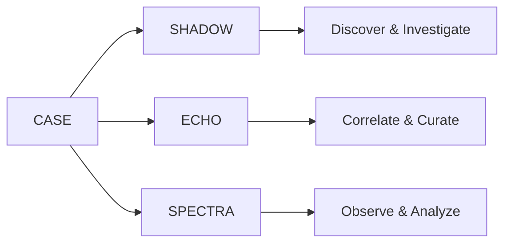

## SHADOW — Case Command Center

**SHADOW discovers and investigates.**

Fokus:
- Case & Investigation;
- Target / Subject;
- Person Lookup;
- identity resolution;
- Target Profile;
- guided enrichment;
- workflow execution;
- Candidate review;
- Profile Inbox;
- Findings;
- intelligence feed;
- Case timeline.

## ECHO — Entity & Relationship Workspace

**ECHO correlates and curates knowledge.**

Fokus:
- canonical Entity;
- relationship graph;
- Case Knowledge;
- Workspace Knowledge;
- relationship candidate;
- evidence correlation;
- hypothesis mapping;
- merge / split;
- conflict review;
- Case → Workspace promotion;
- activity and analysis overlays.

## SPECTRA — Social & Media Intelligence

**SPECTRA observes and analyzes activity.**

Fokus:
- social activity;
- news/media;
- monitoring target;
- watchlist;
- sentiment;
- topic/narrative;
- engagement;
- interaction network;
- temporal pattern;
- anomaly;
- coordination;
- alerts.

> **SPECTRA discovers relationships; ECHO curates relationships.**

---

# 4. Satu Case, Tiga Experience

```text
CASE
│
├── SHADOW
│   ├── Investigations
│   ├── Subjects
│   ├── Workflows
│   ├── Candidates
│   ├── Target Profiles
│   └── Findings
│
├── ECHO
│   ├── Entity References
│   ├── Knowledge Graph
│   ├── Relationship Candidates
│   ├── Correlation
│   └── Hypothesis View
│
├── SPECTRA
│   ├── Monitoring Targets
│   ├── Social Activity
│   ├── News
│   ├── Analyses
│   └── Alerts
│
├── Evidence
├── Datasets
├── Hypotheses
├── Findings
├── Intelligence Feed
└── Timeline
```

Tidak ada data silo SHADOW/ECHO/SPECTRA. Ketiganya memakai domain dan canonical resources yang sama.

---

# 5. Core Principles

1. **Canvas bukan database.**
2. **Candidate bukan Entity.**
3. **Subject bukan Entity.**
4. **Evidence bukan otomatis Truth.**
5. **AnalysisResult bukan Knowledge.**
6. **Alert bukan Finding.**
7. **Case confirmation bukan Workspace promotion.**
8. **Machine output tidak otomatis mengonfirmasi identity/relationship/finding berisiko tinggi.**
9. **Entity reusable di Workspace; Evidence/Hypothesis/Finding tetap Case-scoped.**
10. **Provenance, conflict, revision, dan human decision harus dipertahankan.**

---

# 6. Domain Architecture Map Utama

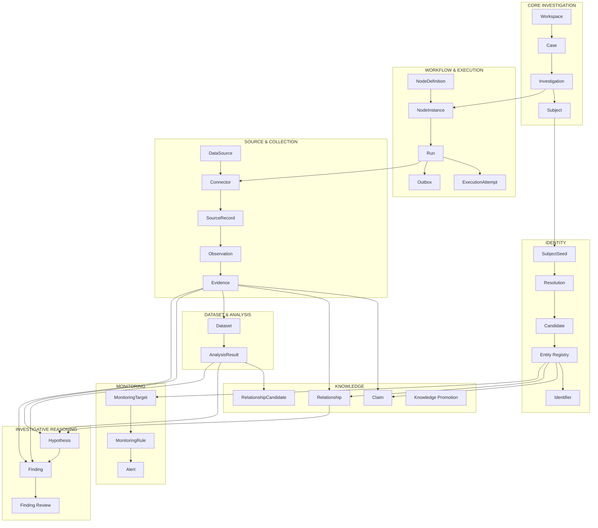

---

# 7. Proposed Domain Ownership

| Module | Owns |
|---|---|
| `workspace` | Workspace, WorkspaceMember |
| `case` | Case, lifecycle |
| `investigation` | Investigation |
| `subject` | InvestigationSubject, SubjectSeed |
| `resolution` | Candidate, ResolutionSession, MatchingSignal, Decision |
| `entity-registry` | Entity, Identifier, Alias, Merge/Split |
| `workflow` | NodeDefinition, NodeInstance, InputBinding |
| `execution` | Run, ExecutionAttempt, ExecutionPlan, checkpoint |
| `source-registry` | DataSourceDefinition, ConnectorDefinition, CapabilityDefinition |
| `evidence` | SourceRecord, Observation, Evidence |
| `dataset` | DatasetSnapshot, DatasetView, completeness |
| `analysis` | AnalysisDefinition, AnalysisResult |
| `knowledge` | Claim, Relationship, Promotion, Revision, Conflict |
| `monitoring` | MonitoringTarget, Schedule, Rule, Alert |
| `intelligence` | Hypothesis, Finding, FindingReview, Highlight |
| `governance` | permissions, policy, classification |
| `audit` | AuditEvent |
| `notification` | Notification |

Backend **tidak** dibagi menjadi `shadow-api`, `echo-api`, `spectra-api`.

---

# 8. Backend Ownership Rule

```text
module/
├── domain/
├── application/
├── infrastructure/
├── presentation/
└── index.ts
```

Allowed:

```text
Resolution
→ EntityRegistryFacade
```

Forbidden:

```text
Resolution
→ EntityRepository
→ entity_registry table
```

Tujuan:
- ownership jelas;
- cross-domain coupling rendah;
- mudah diekstrak menjadi service jika diperlukan;
- lebih mudah dipahami developer dan AI coding agent.

---

# 9. Identity Pipeline


```text
SUBJECT
"What are we investigating?"

RESOLUTION
"Does this candidate correspond to something we already know?"

ENTITY REGISTRY
"What is the canonical reusable object?"

KNOWLEDGE
"What do we know or believe about it?"
```

---

# 10. Subject & SubjectSeed

Subject adalah sesuatu yang sedang diinvestigasi dalam Case.

```text
Case 001
├── Primary Target A
├── Related Target B
└── Person of Interest C
```

Subject bisa unresolved:

```text
Subject
├── entityId?
└── seedId?
```

SubjectSeed menyimpan initial identity dan provenance per field:

```text
name
value
origin
classification
sourceRecord?
evidence?
```

Origin:

```text
INVESTIGATOR_INPUT
SOURCE_RECORD
EVIDENCE
ANALYSIS_EXTRACTION
IMPORT
```

---

# 11. Person Lookup Flow

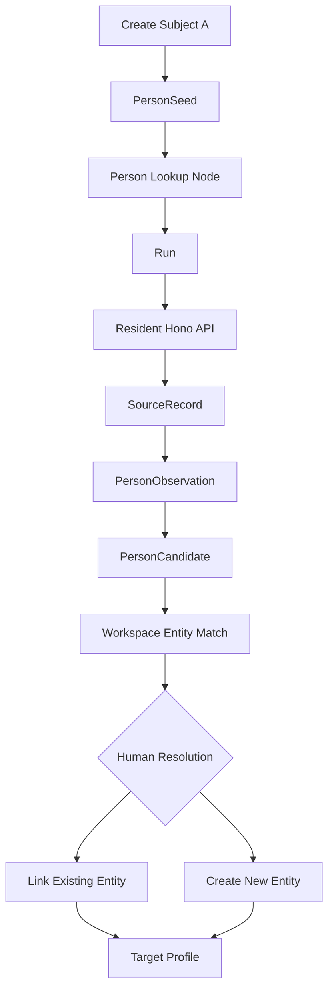

Existing resident data tetap melalui:

```text
Investigation Platform
→ Resident Data Connector
→ Hono Resident API
→ Resident Elasticsearch
```

Tidak ada direct query Platform → Resident Elasticsearch.

---

# 12. Entity Registry

Entity adalah canonical reusable object level Workspace.

```text
Workspace
└── Entity Registry
    ├── PERSON-A
    ├── PERSON-B
    ├── ORG-X
    ├── SOCIAL-ACCOUNT-1
    └── DOMAIN-Y
```

Case hanya membuat reference:

```text
Case
→ CaseEntityReference
→ Workspace Entity
```

Entity dibuat tipis:

```text
Entity
├── id
├── type
├── canonicalLabel
├── aliases
├── identifiers
└── minimal identity attributes
```

Employer, spouse, addresses, social accounts, allegations tidak seharusnya menjadi giant Person fields. Gunakan Claim/Relationship/Evidence.

---

# 13. Identifier

Identifier dipakai untuk dedupe/matching/search.

Contoh:

```text
NIK
email
phone
platformUserId
username
internalResidentId
```

Possible storage:

```text
encryptedValue
comparisonFingerprint/HMAC
maskedValue
classification
status
validFrom
validUntil
```

Permission menggunakan identifier dapat berbeda dengan permission melihat full value.

---

# 14. Entity Merge

Jika dua Entity ternyata sama:

```text
PERSON-404
MERGED INTO
PERSON-101
```

Merge harus:
- auditable;
- non-destructive;
- reversible;
- preserve old references;
- tidak otomatis menggabungkan semua knowledge tanpa review.

---

# 15. Knowledge Architecture

Dua scope:

```text
Case Knowledge
Workspace Knowledge
```

Case Knowledge adalah interpretation dalam Case.

Workspace Knowledge adalah reusable knowledge yang lebih konservatif.

Promotion:

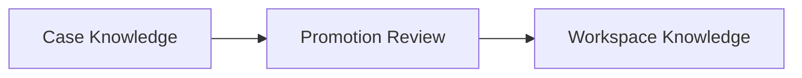

Case confirmation **tidak sama** dengan Workspace promotion.

---

# 16. Relationship Model & Ontology

Concept:

```text
Relationship
sourceEntity
relationshipType
targetEntity
scope
status
confidence
validFrom?
validUntil?
evidence[]
revision
```

Possible ontology:

### Identity / attribution
```text
USES
OWNS
ATTRIBUTED_ACCOUNT
SELF_DECLARED_ACCOUNT
VERIFIED_ACCOUNT
REGISTERED_TO
```

### Organization
```text
WORKS_FOR
MEMBER_OF
FOUNDED
MANAGES
ASSOCIATED_WITH
```

### Communication
```text
COMMUNICATED_WITH
MENTIONED
REPLIED_TO
CONTACTED
```

### Social
```text
FOLLOWS
REPOSTED
MENTIONED
POSTED
```

### Location / event
```text
LOCATED_AT
VISITED
LIVES_AT
ATTENDED
MET_WITH
PARTICIPATED_IN
ORGANIZED
```

Ontology perlu disempurnakan bersama tim berdasarkan use case nyata.

---

# 17. Relationship Candidate

Machine/system boleh menghasilkan:

```text
A ? ASSOCIATED_WITH ? B
```

sebagai `RelationshipCandidate`.

Candidate membawa:

```text
source endpoint
target endpoint
suggested relation
analysis confidence
signals
evidence refs
status
```

ECHO menampilkan candidate sebagai dashed edge.

Human review:

```text
RelationshipCandidate
→ Confirm
→ Case Relationship
```

---

# 18. ECHO Graph Layers

```text
Layer 1 — Workspace Knowledge
Layer 2 — Case Knowledge
Layer 3 — Relationship Candidates
Layer 4 — Observed Activity
Layer 5 — Analysis Overlay
Layer 6 — Hypothesis Mapping
```

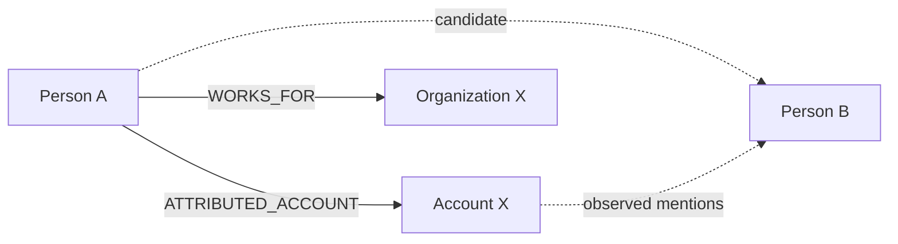

Solid = curated knowledge.  
Dashed = candidate / observation / analysis.

---

# 19. Three Graphs

## Workflow Graph
Menjawab: **proses apa yang dijalankan?**

```text
Person
→ Person Lookup
→ Social Account Finder
→ Collect Activity
→ Sentiment Analysis
```

## Knowledge Graph
Menjawab: **apa yang kita tahu?**

```text
Person A
→ WORKS_FOR
→ Org X
```

## Evidence / Provenance Graph
Menjawab: **mengapa kita percaya conclusion ini?**

```text
Finding
→ Claim / Relationship
→ Evidence
→ SourceRecord
→ Connector
→ Run
→ Data Source
```

---

# 20. Evidence Pipeline

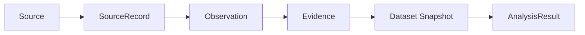

- **SourceRecord:** raw source-result metadata + provenance.
- **Observation:** apa yang source laporkan.
- **Evidence:** normalized investigation artifact.
- **Dataset:** evidence collection untuk analysis.
- **AnalysisResult:** hasil model/algorithm.

Source truth dan investigation truth tetap terpisah.

---

# 21. Dataset & Completeness

Jenis:

```text
DatasetSnapshot
DatasetView
```

Snapshot immutable agar analysis reproducible.

View dynamic harus disnapshot sebelum analysis kritis.

Completeness:

```text
COMPLETE
PARTIAL
UNKNOWN
```

Contoh:

```text
PARTIAL
reason: source rate limit interrupted pagination
```

---

# 22. Analysis

Analysis menghasilkan hasil baru, tidak memodifikasi Evidence.

Contoh:

```text
SentimentResult
EntityExtractionResult
CoordinationResult
NetworkCluster
TopicResult
TrendResult
AnomalyResult
```

AnalysisResult menyimpan:

```text
datasetId
analysisDefinition
model
modelVersion
configuration
createdAt
artifact refs
```

---

# 23. Social Activity

Social post biasanya tetap Evidence:

```text
SOCIAL-ACCOUNT-X
├── Evidence Post 1
├── Evidence Post 2
└── Evidence Post 3
```

Tidak semua post menjadi Knowledge Graph node.

ECHO dapat memakai aggregate activity overlay untuk menjaga graph tetap usable.

---

# 24. Monitoring Flow

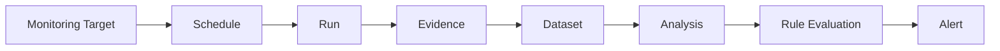

Monitoring menggunakan execution runtime yang sama. Tidak ada execution engine kedua.

Alert lifecycle:

```text
OPEN
→ ACKNOWLEDGED
→ INVESTIGATING
→ RESOLVED
```

atau:

```text
DISMISSED
```

---

# 25. Recursive Discovery

Salah satu flow utama:

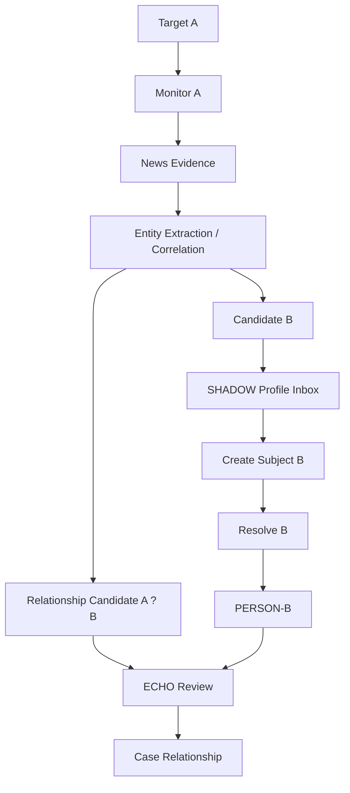

Sebelum resolved, B tetap Candidate/Subject Seed, bukan Person Entity.

---

# 26. Profile Inbox

Unified SHADOW review experience untuk:

```text
UNRESOLVED_SUBJECT
PERSON_CANDIDATE
SOCIAL_ACCOUNT_CANDIDATE
EXTRACTED_ENTITY_CANDIDATE
RELATIONSHIP_DISCOVERY
```

Actions:

```text
Investigate
Link Existing
Compare
Ignore
```

Profile Inbox bukan canonical truth store.

---

# 27. Target Profile

Target Profile adalah read model / dossier.

```text
TargetProfileView
├── identity
├── permitted identifiers
├── aliases
├── known accounts
├── knowledge
├── recent evidence
├── current Case context
├── monitoring summary
├── ECHO relationship summary
└── freshness
```

Action:

```text
Refresh Identity
Find Social Accounts
Find News
Enrich
Monitor
Open in ECHO
```

Semua action tetap melalui Node/Run.

---

# 28. Hypothesis

Hypothesis adalah proposition yang sedang diuji.

```text
"Person A and Person B maintain an operational relationship."
```

Lifecycle:

```text
DRAFT
ACTIVE
CLOSED
ARCHIVED
```

Assessment:

```text
UNASSESSED
SUPPORTED
CONTRADICTED
INCONCLUSIVE
```

Evidence role:

```text
SUPPORTS
CONTRADICTS
CONTEXT
QUALIFIES
```

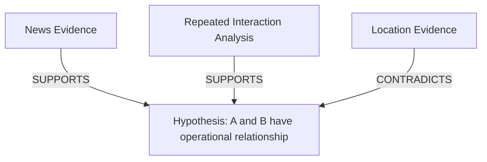

---

# 29. Finding

Finding adalah analyst conclusion, bukan machine output.

```text
type
title
statement
rationale
confidence
supporting resources
contradicting resources
subjects
review
revision
```

Lifecycle:

```text
DRAFT
→ IN_REVIEW
→ APPROVED
```

Alternative/future:

```text
REJECTED
SUPERSEDED
RETRACTED
```

Approved Finding tidak diedit diam-diam.

---

# 30. Defensible Finding

Approved Finding harus menjawab:

```text
Who wrote it?
Who reviewed it?
When?
What evidence supports it?
What contradicts it?
Which analysis/model was used?
Which dataset?
Which knowledge revision?
Which hypothesis?
Which source/connector/run?
```

Provenance:

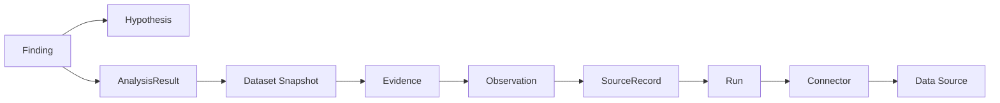

---

# 31. Workflow Runtime

```text
NodeDefinition
→ NodeInstance
→ Run
```

NodeDefinition = business capability.

Connector = technical integration.

Example:

```text
Node: Person Lookup
Capability: PERSON_LOOKUP
```

Possible connectors:

```text
Resident Hono Connector
Internal Directory Connector
Authorized Provider Connector
```

Run is immutable execution history.

---

# 32. Run vs Attempt

```text
Run
= business execution intent

ExecutionAttempt
= one infrastructure attempt
```

Example:

```text
RUN-1
├── Attempt 1 FAILED_NETWORK
├── Attempt 2 FAILED_TIMEOUT
└── Attempt 3 COMPLETED
```

User retry creates new Run with `retryOf`.

---

# 33. Fan-out / Fan-in

```text
Person
→ Social Account Finder
   ├── X Connector Run
   ├── Instagram Connector Run
   ├── GitHub Connector Run
   └── Other Connector Run
→ aggregate candidates
→ review
```

---

# 34. Physical Architecture

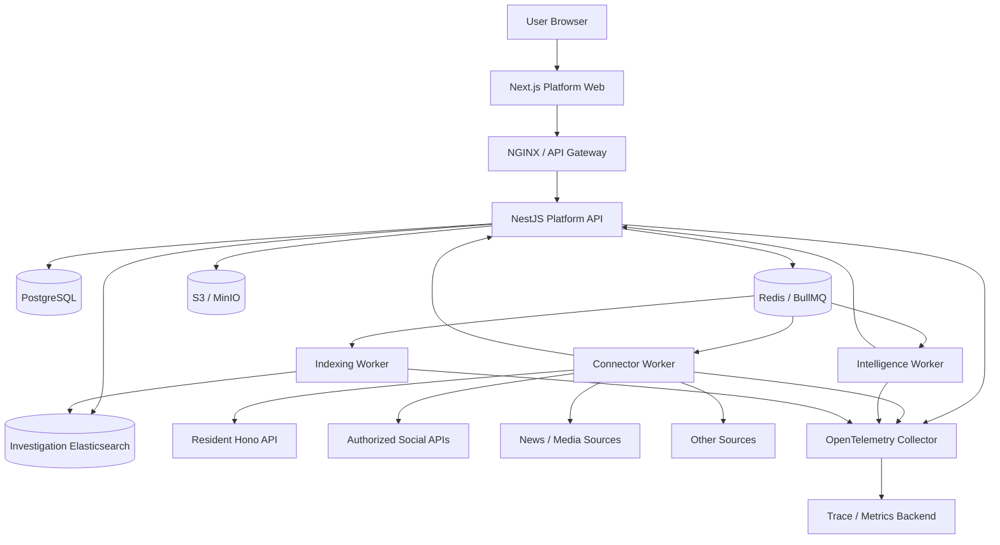

---

# 35. Control Plane vs Execution Plane

## Control Plane — Platform API

Owns canonical commands dan decision:

```text
Case
Subject
Resolution
Entity
Knowledge
Run creation
Governance
Review
Hypothesis
Finding
```

## Execution Plane — Workers

Menjalankan:

```text
connector execution
collection
analysis
indexing
```

Workers tidak direct-write business DB.

---

# 36. Restricted Worker Boundary

Queues/work profiles:

```text
connector.general
connector.restricted
intelligence.processing
indexing
maintenance
```

Resident connector memakai restricted worker profile dengan network/credential policy terpisah.

---

# 37. Transactional Outbox

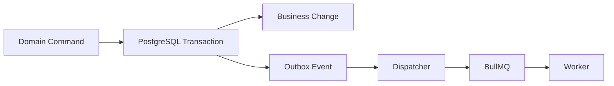

Broker bukan bagian business transaction.

Delivery = **at least once**. Consumer wajib idempotent.

Outbox membawa small references, bukan bulk evidence atau PII.

---

# 38. Storage Responsibilities

## PostgreSQL
Canonical transactional truth:

```text
Case
Subject
Resolution
Entity Registry
Knowledge
Evidence metadata
Dataset metadata
Analysis metadata
Monitoring
Hypothesis
Finding
Audit metadata
```

## S3 / MinIO
```text
documents
media
raw artifacts
large analysis artifacts
exports
```

## Investigation Elasticsearch
Search projection, bukan truth.

## Redis / BullMQ
Async transport/operational state, bukan canonical truth.

---

# 39. Search Architecture

```text
Canonical DB
→ Outbox/Event
→ Indexing Worker
→ Investigation Elasticsearch
```

Elasticsearch outage tidak boleh merusak canonical write. Search dapat degraded/stale.

---

# 40. Realtime

Initial transport: **SSE**.

Events:

```text
RUN_PROGRESS_UPDATED
RUN_COMPLETED
CANDIDATE_READY
ENTITY_UPDATED
KNOWLEDGE_CHANGED
DATASET_READY
ANALYSIS_COMPLETED
ALERT_RAISED
NOTIFICATION_CREATED
```

Realtime event minimal; client refetch canonical resource.

---

# 41. Security & Governance

Classification:

```text
PUBLIC
INTERNAL
SENSITIVE
RESTRICTED
```

Field visibility:

```text
FULL
MASKED
MATCH_ONLY
HIDDEN
```

Example restricted identifier:

```text
FULL       3374xxxxxxxx8291
MASKED     3374••••••••8291
MATCH_ONLY Exact National ID Match
HIDDEN     no disclosure
```

Permission to use dapat berbeda dari permission to view.

---

# 42. Cross-Case Confidentiality

Entity reusable tidak berarti semua Case context ikut terbuka.

```text
Same Entity ID
≠
Permission to see every Case using it
```

Possible permission distinction:

```text
ENTITY_EXISTENCE_DISCOVER
CROSS_CASE_CONTEXT_VIEW
CROSS_CASE_EVIDENCE_VIEW
```

---

# 43. Audit vs Observability

Audit:

```text
Who?
Did what?
To which resource?
In which Case?
Why?
When?
Outcome?
```

Observability:

```text
requestId
traceId
runId
attemptId
latency
error
queue lag
```

Audit adalah business/compliance history; observability adalah technical health.

---

# 44. Monorepo Direction

```text
intelligence-platform/
├── apps/
│   ├── platform-web/
│   ├── platform-api/
│   ├── connector-worker/
│   ├── intelligence-worker/
│   └── indexing-worker/
├── packages/
│   ├── contracts/
│   ├── api-client/
│   ├── ui/
│   ├── canvas-kit/
│   ├── auth/
│   ├── connector-sdk/
│   ├── database/
│   ├── observability/
│   ├── config/
│   └── testing/
├── infrastructure/
├── tooling/
└── docs/
```

---

# 45. Frontend Boundaries

```text
products/
├── shadow/
├── echo/
└── spectra/
```

Forbidden:

```text
SHADOW → ECHO internals
```

Cross-product interaction melalui API/contracts/ResourceRef/DeepLinkTarget.

---

# 46. Reference Flow — Target A sampai Finding

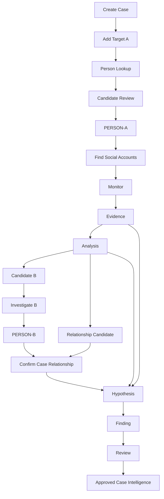

---

# 47. Scenario Example

1. Investigator membuat Case.
2. Menambahkan Target A dari nama/partial identity.
3. SHADOW menjalankan Person Lookup ke Hono.
4. SourceRecord dan PersonObservation dibuat.
5. Candidates ditampilkan.
6. Investigator link existing Entity atau create Person Entity baru.
7. SHADOW menampilkan Target Profile A.
8. Investigator mencari social accounts/news.
9. SPECTRA mulai monitoring.
10. News Evidence menyebut A bersama unknown B.
11. Analysis menghasilkan Candidate B + RelationshipCandidate.
12. SHADOW Profile Inbox menawarkan **Investigate B**.
13. B dibuat sebagai Subject dengan provenance dari Evidence.
14. Resolution B menghasilkan PERSON-B.
15. ECHO menampilkan A ? B sebagai candidate relation.
16. Investigator review evidence dan confirm Case Relationship jika layak.
17. Investigator membuat Hypothesis.
18. Supporting dan contradicting material ditautkan.
19. Hypothesis di-assess.
20. Finding dibuat, direview, lalu approved.
21. Finding tetap traceable hingga source/run/connector.

---

# 48. Intelligence Feed Example

```text
09:10  Target A identity resolved
10:02  Social account candidate confirmed
11:14  New news evidence collected
11:20  Candidate B discovered
13:15  Relationship candidate created
14:02  Hypothesis assessed SUPPORTED
16:30  Finding approved
```

Feed = high-value investigator-facing intelligence events.  
Feed bukan audit log.

---

# 49. What AI May Do

AI dapat membantu:

```text
entity extraction
candidate generation
duplicate suggestion
summarization
timeline synthesis
sentiment/topic/narrative
hypothesis suggestion
draft finding wording
next-step suggestion
```

AI tidak otomatis:

```text
confirm identity
merge Entity
promote Workspace Knowledge
confirm sensitive relationship
approve Finding
```

---

# 50. Performance Principles

```text
no unbounded list
cursor pagination
server-side aggregation
batch evidence ingestion
small queue payload
object references for large artifacts
focused graph neighborhood
projection search
async external source access
```

ECHO tidak merender seluruh evidence universe sebagai graph node.

SPECTRA tidak load jutaan activity items ke browser sekaligus.

---

# 51. Security Principles

```text
least privilege
case isolation
field-level visibility
restricted worker
PII-safe logs
server-side authorization
private object storage
short-lived signed URL
connector egress allowlist
SSRF protection
immutable history
audit
```

---

# 52. Proposed MVP

MVP harus membuktikan satu investigation loop utuh:

```text
Create Case
→ Add Subject A
→ Resident Person Lookup
→ Candidate Review
→ Entity A
→ Target Profile
→ Evidence
→ Knowledge
→ Dataset
→ Basic Analysis
→ Candidate B
→ Resolve B
→ Relationship
→ Hypothesis
→ Finding
→ Review
```

Keberhasilan MVP bukan jumlah page, tetapi satu loop end-to-end dengan provenance dan governance.

---

# 53. Out of Scope untuk MVP

Tidak harus ada:

```text
Neo4j canonical store
microservices per domain
large connector marketplace
full AI platform
automatic Finding approval
complex report builder
mobile parity
full collaborative graph
shared collection optimization
```

---

# 54. Product & Architecture Discussion Questions

## Workflow
- Apakah satu Case selalu perlu Investigation child?
- Berapa primary target yang umum dalam satu Case?
- Subject type apa selain Person yang penting?

## Entity
- Entity type mana yang wajib di MVP?
- Apa yang harus reusable lintas-case?
- Kapan duplicate Entity paling berbahaya?

## Relationship
- Relationship ontology apa yang dibutuhkan?
- Mana yang confirmed knowledge vs observed activity?
- Apakah relation perlu validity time?
- Bagaimana candidate vs confirmed divisualisasikan?

## Evidence
- Raw payload apa yang perlu disimpan?
- Screenshot itu Evidence atau artifact?
- Retention per source seperti apa?

## Resolution
- Signal apa yang paling penting untuk Person matching?
- Kapan exact identifier boleh auto-link?
- Kapan human review wajib?

## SPECTRA
- Monitoring use case utama?
- Social, news, sentiment, narrative, coordination?
- Alert seperti apa yang benar-benar actionable?

## ECHO
- Graph atau structured relation table mana yang lebih sering dipakai?
- Bagaimana conflict divisualisasikan?
- Perlu temporal relationship view?

## Finding
- Siapa yang boleh approve?
- Apakah author boleh approve sendiri?
- Perlu multi-reviewer?
- Bagaimana Report mengambil Findings?

---

# 55. Potential Extensions

## Report Builder
```text
Approved Findings
→ Executive Summary
→ Timeline
→ Graph
→ Evidence References
→ Caveats
→ Export
```

## Investigation Playbooks
```text
Person Profiling
Social Attribution
Organization Mapping
Narrative Monitoring
Coordinated Activity Investigation
```

## Advanced Identity Resolution
- probabilistic matching;
- cross-source identity graph;
- temporal identifiers;
- alias evolution.

## Collaboration
- comments;
- analyst mentions;
- review assignment;
- shared hypothesis board;
- case handover.

## AI Investigator Assistant
- summarize case;
- identify contradictions;
- suggest missing evidence;
- suggest next steps;
- draft hypothesis/finding;
- explain candidate match.

---

# 56. Product Differentiator

Produk ini bukan hanya:

```text
OSINT search box
social scraper
graph viewer
case note app
```

Nilai utamanya berasal dari kombinasi:

```text
Identity Resolution
+
Evidence Provenance
+
Knowledge Graph
+
Monitoring
+
Analysis
+
Investigative Reasoning
+
Governance
```

---

# 57. North-Star User Journey

```text
"I have Target A."
        ↓
"Who exactly is A?"
        ↓
"What accounts/entities are associated with A?"
        ↓
"What is A doing?"
        ↓
"Who is A connected to?"
        ↓
"What new people/entities have we discovered?"
        ↓
"What hypotheses can we test?"
        ↓
"What supports or contradicts them?"
        ↓
"What can we confidently conclude?"
```

---

# 58. One-Sentence Architecture Summary

> **SHADOW investigates subjects, ECHO curates entities and relationships, SPECTRA observes activity, while a shared evidence-first domain architecture ensures every conclusion remains traceable to its source, execution, analysis, and human decision.**

# 59. One-Sentence Product Pitch

> **Investigation Intelligence Platform transforms fragmented investigative data into structured, explainable, continuously monitored, and defensible intelligence.**

---

# 60. Suggested Team Workshop

### Session 1 — Product & User Flow
```text
Case
Subject
Target Profile
SHADOW
ECHO
SPECTRA
```

### Session 2 — Entity & Relationship
```text
Entity types
Identifier
Relationship ontology
Candidate vs confirmed
Case vs Workspace Knowledge
```

### Session 3 — Evidence & Analysis
```text
SourceRecord
Observation
Evidence
Dataset
Analysis
Monitoring
```

### Session 4 — Reasoning
```text
Hypothesis
Finding
Review
Report
```

### Session 5 — Security & Operations
```text
classification
cross-case visibility
restricted source
audit
retention
performance
```

Expected output:

```text
new ideas
missing entities
missing relationships
workflow changes
MVP priorities
open architecture decisions
future backlog
```

---

# 61. Quick Glossary

| Term | Meaning |
|---|---|
| Workspace | Organizational knowledge boundary |
| Case | Investigation context |
| Investigation | Specific investigative branch/objective |
| Subject | What/person being investigated |
| SubjectSeed | Initial unresolved identity information |
| Candidate | Possible resolution/discovery result |
| Entity | Canonical reusable object |
| Identifier | Stable/searchable identity key |
| SourceRecord | Immutable source result metadata |
| Observation | What source reported |
| Evidence | Normalized investigation artifact |
| Dataset | Evidence collection used for analysis |
| AnalysisResult | Machine/algorithm result |
| Claim | Atomic knowledge proposition |
| Relationship | Curated Entity-to-Entity knowledge |
| RelationshipCandidate | Suggested relation awaiting review |
| MonitoringTarget | Entity/resource observed repeatedly |
| Alert | Monitoring condition requiring attention |
| Hypothesis | Proposition being tested |
| Finding | Analyst conclusion |
| Run | Business execution instance |
| ExecutionAttempt | Infrastructure attempt for a Run |
| Connector | Technical source integration |
| DataSource | Logical information source |
| Target Profile | SHADOW dossier/read model |
| Profile Inbox | Unresolved discoveries needing action |

---

# 62. Final Message for the Team

Kita tidak sedang membangun dashboard besar dengan banyak menu.

Kita sedang membangun sebuah **investigation operating system**.

Sistem membantu investigator bergerak dari:

```text
unknown
→ discovered
→ verified
→ connected
→ observed
→ analyzed
→ questioned
→ concluded
```

tanpa kehilangan:

```text
source
history
context
conflict
security
human decision
```

Keberhasilan desain bukan seberapa banyak data yang dapat ditampilkan.

Keberhasilan desain adalah ketika investigator dapat menjawab:

> **Apa yang kita tahu, mengapa kita percaya hal itu, apa yang masih belum pasti, dan apa yang sebaiknya kita investigasi berikutnya?**
